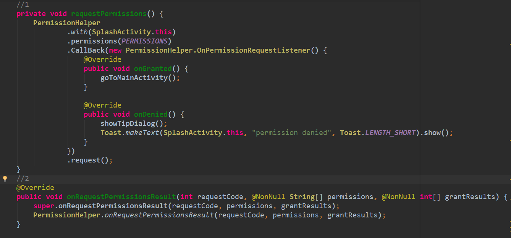
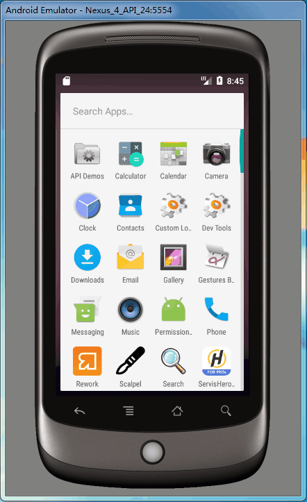

# PermissionHelper
android 6.0 运行时权限申请的简单封装（简单 好用 可拓展）
### 想了解哪些权限需要需要再运行时申请即危险权限请参阅 [google 官方文档](https://developer.android.google.cn/guide/topics/security/permissions.html?hl=zh-cn#normal-dangerous)

# Use

# ScreenShot

